# ☕ Java Programming — Final Exam Preparation Notebook

**OOP · JDBC · JavaFX · Socket & RMI · Servlet/JSP · Spring Boot · GoF Design Patterns**

> 12 Question Sets (L1–L12) · Each set = 3 sub-questions (`X.1`–`X.3`) · Theory + Practical · ~12–15 min each
> Together these sets form the complete **Final Exam preparation notebook** for the Bachelor-level Java course.

---

## 📑 Contents

| Set | Topic |
|---|---|
| [L1](#-l1--encapsulation-and-polymorphism) | Encapsulation and Polymorphism |
| [L2](#-l2--method-overloading-vs-overriding-early-vs-late-binding) | Method Overloading vs Overriding (Early vs Late Binding) |
| [L3](#-l3--abstract-class-vs-interface) | Abstract Class vs Interface |
| [L4](#-l4--collection-framework) | Collection Framework (ArrayList, Vector, LinkedList, Set, TreeSet) |
| [L5](#-l5--multithreading--custom-exception-handling) | Multithreading & Custom Exception Handling |
| [L6](#-l6--jdbc-with-mysqloracle-mvc-pattern) | JDBC with MySQL/Oracle (MVC Pattern) |
| [L7](#-l7--javafx--house-loan-calculator) | JavaFX — House Loan Calculator |
| [L8](#-l8--socket-programming--java-rmi-chat-system) | Socket Programming & Java RMI (Chat System) |
| [L9](#-l9--servlet--jsp--jdbc-crud-student-records) | Servlet + JSP + JDBC CRUD (Student Records) |
| [L10](#-l10--spring-boot-rest-api-with-jpaorm) | Spring Boot REST API with JPA/ORM |
| [L11](#-l11--servlet-crud-district-quiz-game) | Servlet CRUD — District Quiz Game |
| [L12](#-l12--gof-design-patterns) | GoF Design Patterns — Creational (5) & Structural (7) |

---

## 📘 L1 — Encapsulation and Polymorphism

⏱ Suggested time: 40 minutes

| # | Type | Marks | Question |
|---|---|---|---|
| 1.1 | Theory | 5 | What is encapsulation? Explain how Java achieves it using access modifiers and getter/setter methods. Give one real-life analogy. |
| 1.2 | Theory | 5 | What is polymorphism? Distinguish compile-time (static) vs run-time (dynamic) polymorphism with one example each. |
| 1.3 | Practical | 10 | Write a `BankAccount` class demonstrating **encapsulation** (private `balance` + `getBalance()`/`deposit()`) **and polymorphism** (overloaded `deposit(double)` / `deposit(double, String remarks)`). Include a `Main` class calling both overloads. |

<details>
<summary><b>📐 Reference UML — BankAccount (encapsulation + overload)</b></summary>

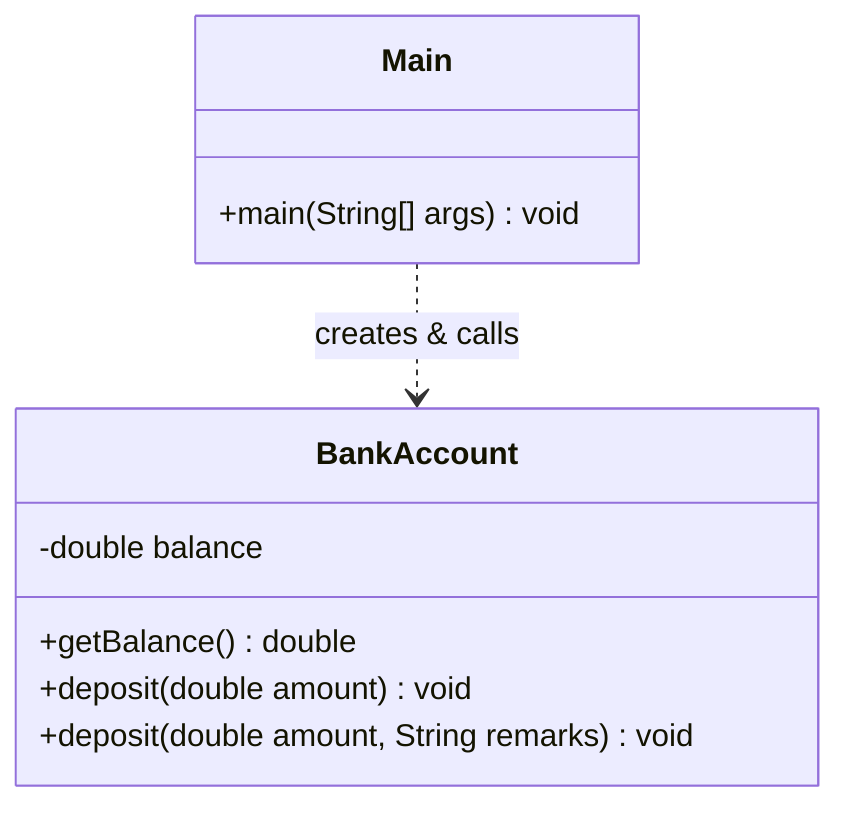
</details>

---

## 📘 L2 — Method Overloading vs Overriding (Early vs Late Binding)

⏱ Suggested time: 40 minutes

| # | Type | Marks | Question |
|---|---|---|---|
| 2.1 | Theory | 5 | Compare **overloading vs overriding**: definition, class involved, parameters, return type, binding time. |
| 2.2 | Theory | 5 | Explain **early binding** vs **late binding**. Why is overriding resolved at run time and overloading at compile time? |
| 2.3 | Practical | 10 | `Shape` with `area()`, overridden by `Circle` and `Rectangle` (late binding via `Shape` reference). Add overloaded `describe(String)` / `describe(String, int)` in `Shape` (early binding). Show sample output. |

<details>
<summary><b>📐 Reference UML — Overriding hierarchy</b></summary>

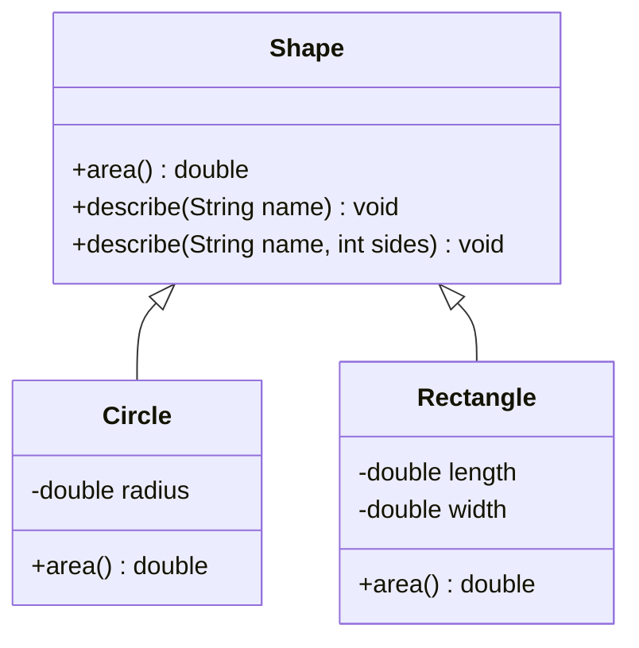

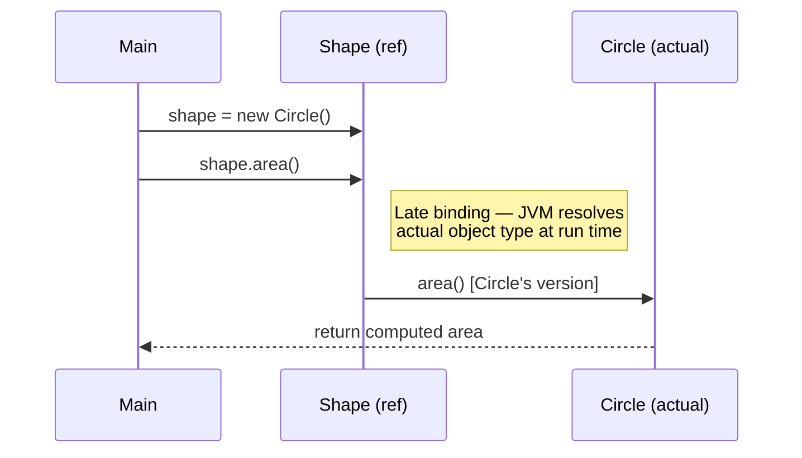
</details>

---

## 📘 L3 — Abstract Class vs Interface

⏱ Suggested time: 40 minutes

| # | Type | Marks | Question |
|---|---|---|---|
| 3.1 | Theory | 5 | Define abstract class & interface. List ≥4 structural differences (fields, constructors, method bodies, multiple inheritance). |
| 3.2 | Theory | 5 | When should you choose an abstract class vs an interface? Give two real-world scenarios ("is-a" with shared code vs "can-do" capability). |
| 3.3 | Practical | 10 | `Vehicle` (abstract, `startEngine()` implemented + abstract `fuelType()`) and `Insurable` (interface, `calculatePremium()`). `Car` extends `Vehicle` and implements `Insurable`. Comment on why each construct was chosen. |

<details>
<summary><b>📐 Reference UML — Vehicle / Insurable / Car</b></summary>

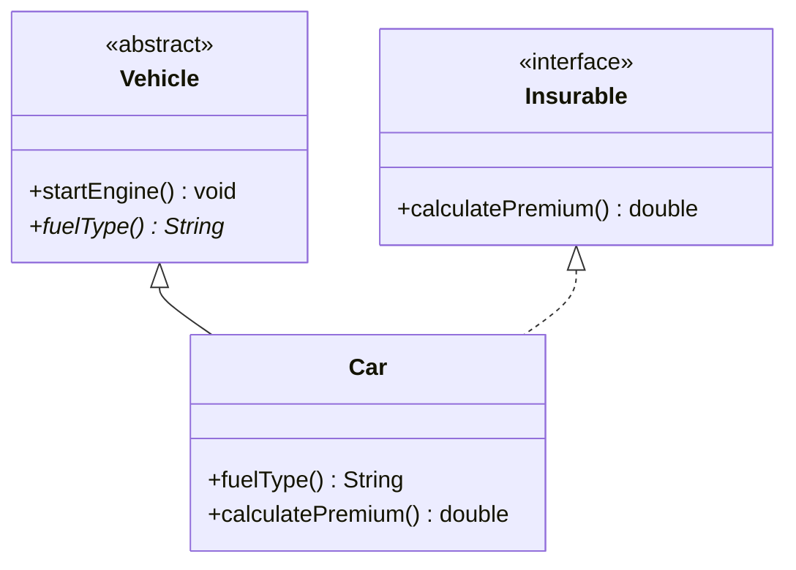

| Aspect | Abstract Class | Interface |
|---|---|---|
| Relationship | "is-a" | "can-do" |
| Fields | Can have state | Only `static final` constants |
| Constructors | Yes | No |
| Method body | Mix of concrete + abstract | Default/static only (no forced impl. state) |
| Multiple inheritance | Single class only | A class can implement many |

</details>

---

## 📘 L4 — Collection Framework

⏱ Suggested time: 40 minutes

| # | Type | Marks | Question |
|---|---|---|---|
| 4.1 | Theory | 5 | Compare `ArrayList`, `Vector`, `LinkedList`: underlying structure, synchronization, insert/delete vs random-access performance. |
| 4.2 | Theory | 5 | Explain `Set` and its implementations `HashSet`, `LinkedHashSet`, `TreeSet`. How does `TreeSet` maintain order? |
| 4.3 | Practical | 10 | Store 5 student names in an `ArrayList` (print with enhanced for-loop) and in a `TreeSet` (print, observe sorting). Comment on ordering difference. |

<details>
<summary><b>📐 Reference UML — Collection Framework hierarchy</b></summary>

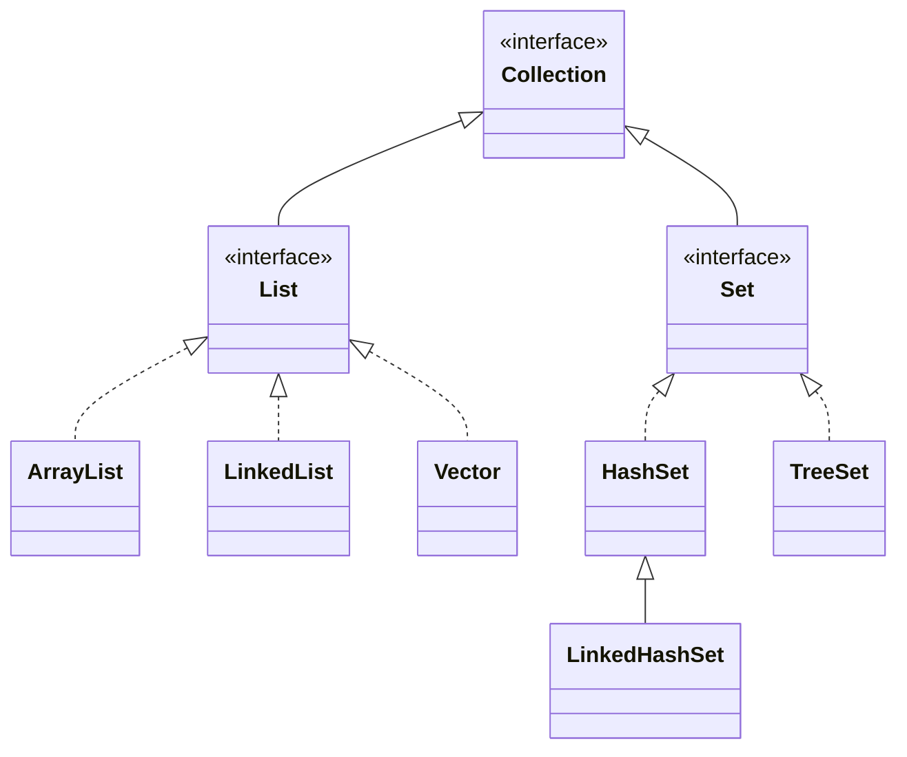
</details>

---

## 📘 L5 — Multithreading & Custom Exception Handling

⏱ Suggested time: 40 minutes

| # | Type | Marks | Question |
|---|---|---|---|
| 5.1 | Theory | 5 | List ≥3 ways to implement multithreading in Java (`extends Thread`, `implements Runnable`, `ExecutorService`/`Callable`). Which is preferred and why? |
| 5.2 | Practical | 5 | Two threads printing 1–5 concurrently — one via `extends Thread`, one via `implements Runnable`. Show how both are started from `main()`. |
| 5.3 | Practical | 10 | Custom checked exception `InvalidRadiusException`. `Circle` constructor throws it if radius < 0. `Main` reads radius, handles via try-catch, else prints area. |

<details>
<summary><b>📐 Reference UML — Threads & Custom Exception</b></summary>

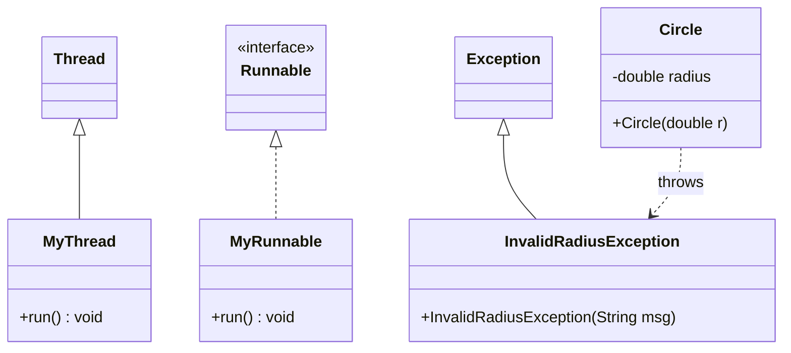
</details>

---

## 📘 L6 — JDBC with MySQL/Oracle (MVC Pattern)

⏱ Suggested time: 40 minutes

| # | Type | Marks | Question |
|---|---|---|---|
| 6.1 | Theory | 5 | Steps to connect Java to MySQL/Oracle via JDBC. Name key classes (`DriverManager`, `Connection`, `PreparedStatement`, `ResultSet`). |
| 6.2 | Theory | 5 | Explain the MVC pattern and how a JDBC app's classes map to Model/View/Controller. |
| 6.3 | Practical | 10 | MVC-style code for `Student`: Model (`Student`), Controller/DAO (`StudentDAO.insert()` using `PreparedStatement`), View (`Main`) collecting input and calling the controller. |

<details>
<summary><b>📐 Reference UML — MVC + JDBC flow</b></summary>

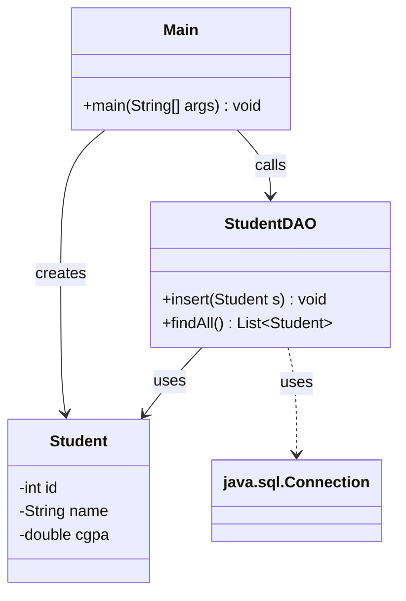

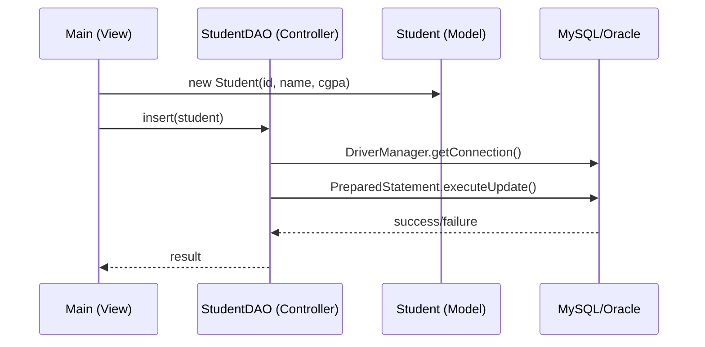
</details>

---

## 📘 L7 — JavaFX — House Loan Calculator

⏱ Suggested time: 40 minutes

| # | Type | Marks | Question |
|---|---|---|---|
| 7.1 | Theory | 5 | Explain the JavaFX application structure (`Application`, `Stage`, `Scene`, `GridPane`/`VBox`). Role of `start()`? |
| 7.2 | Practical | 10 | Design the `GridPane` layout: Loan Amount, Annual Rate, Number of Years inputs + "Calculate" button + result labels. |
| 7.3 | Practical | 5 | Event handler computing **Monthly Installment** (amortization formula), **Total Payment**, and **Difference** (Total Payment − Loan Amount). |

<details>
<summary><b>📐 Reference — Loan Calculator formula & flow</b></summary>

```
Monthly Rate:  r = AnnualRate / 12 / 100
Monthly Installment:  M = P × r × (1 + r)^n / [(1 + r)^n − 1]
Total Payment:  T = M × n
Difference:  D = T − P
```

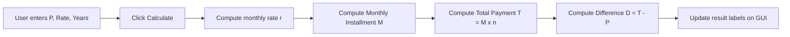
</details>

---

## 📘 L8 — Socket Programming & Java RMI (Chat System)

⏱ Suggested time: 40 minutes

| # | Type | Marks | Question |
|---|---|---|---|
| 8.1 | Theory | 5 | Compare Socket programming vs Java RMI. When to prefer each? |
| 8.2 | Practical | 8 | Server code using `ServerSocket`: accept connection, read via `BufferedReader`, reply via `PrintWriter`. |
| 8.3 | Practical | 7 | Client code using `Socket`: connect to server, send typed message, print server reply. |

<details>
<summary><b>📐 Reference UML — Client/Server chat sequence</b></summary>

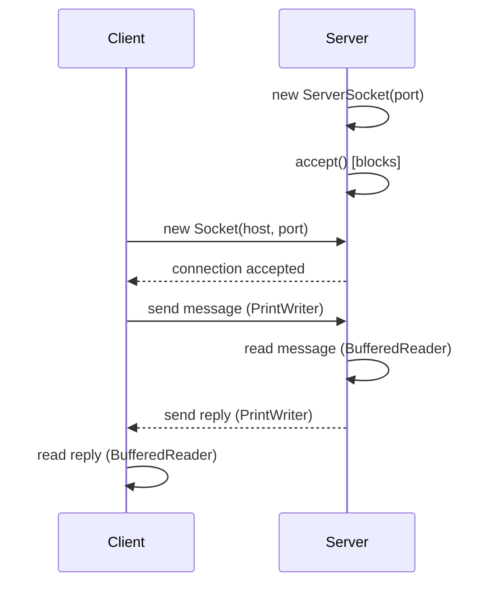

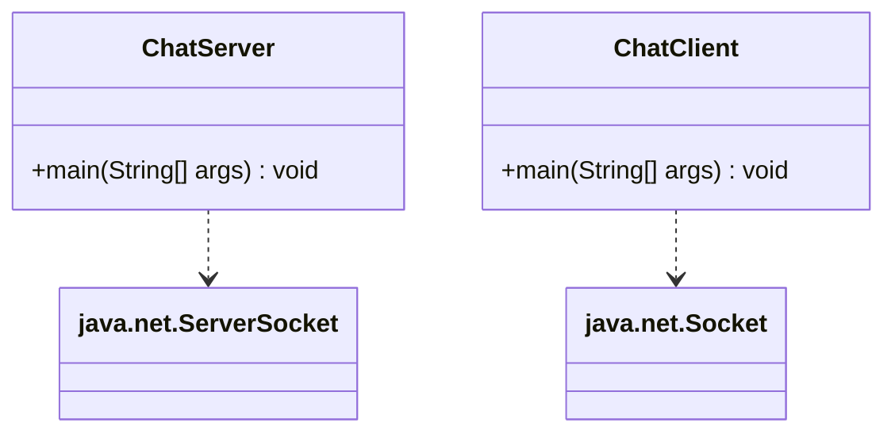
</details>

---

## 📘 L9 — Servlet + JSP + JDBC CRUD (Student Records)

⏱ Suggested time: 40 minutes

| # | Type | Marks | Question |
|---|---|---|---|
| 9.1 | Theory | 5 | Steps to set up `student_db` / `Students` table project with Servlet + JSP + JDBC (DB setup, mapping, connection string). |
| 9.2 | Practical | 8 | Servlet `doPost()`: read ID/Name/CGPA from form, insert via `PreparedStatement`, with exception handling. |
| 9.3 | Practical | 7 | JSP page: connect to `student_db`, `SELECT` from `Students`, display as HTML table. |

<details>
<summary><b>📐 Reference UML — Servlet/JSP MVC request flow</b></summary>

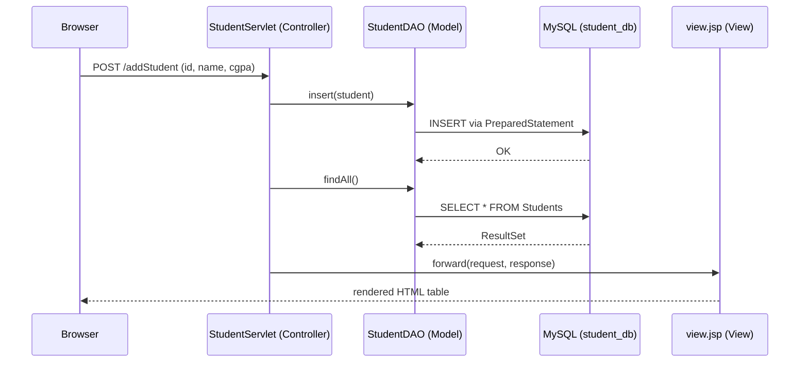
</details>

---

## 📘 L10 — Spring Boot REST API with JPA/ORM

⏱ Suggested time: 40 minutes

| # | Type | Marks | Question |
|---|---|---|---|
| 10.1 | Theory | 5 | Steps to set up Spring Boot + REST + JPA (Maven deps: `spring-boot-starter-web`, `spring-boot-starter-data-jpa`, MySQL connector) and role of embedded Tomcat. |
| 10.2 | Practical | 8 | JPA `Student` entity (`id`, `name`, `cgpa`) + `StudentRepository extends JpaRepository`. |
| 10.3 | Practical | 7 | `@RestController` with `GET /students` and `POST /students` endpoints using the repository. |

<details>
<summary><b>📐 Reference UML — Spring Boot layered architecture</b></summary>

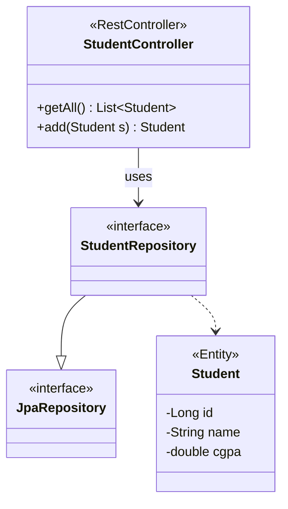

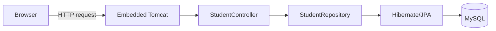
</details>

---

## 📘 L11 — Servlet CRUD — District Quiz Game

⏱ Suggested time: 40 minutes

| # | Type | Marks | Question |
|---|---|---|---|
| 11.1 | Theory | 5 | Design DB schema for quiz on Crops / Geography / Academic Institutions of your district + Player/Score table. Justify design. |
| 11.2 | Practical | 8 | Servlet method: save Player name + final score into `PlayerScore` via JDBC/`PreparedStatement`. |
| 11.3 | Practical | 7 | Quiz logic: ≥3 MCQs (crop, geography, institution) as objects; present, check answer, increment score. |

<details>
<summary><b>📐 Reference — ER diagram for quiz schema</b></summary>

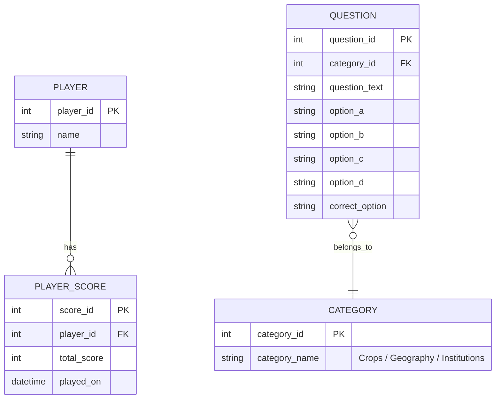
</details>

---

## 📘 L12 — GoF Design Patterns

⏱ Suggested time: 40 minutes

| # | Type | Marks | Question |
|---|---|---|---|
| 12.1 | Theory | 6 | List all 5 GoF **Creational** patterns (Singleton, Factory Method, Abstract Factory, Builder, Prototype) with one-line purpose each. |
| 12.2 | Theory | 7 | List all 7 GoF **Structural** patterns (Adapter, Bridge, Composite, Decorator, Facade, Flyweight, Proxy) with one-line purpose each. |
| 12.3 | Practical | 7 | Implement **Singleton** (thread-safe) and **Adapter** with short, complete Java code examples. |

<details>
<summary><b>📐 Reference UML — Singleton & Adapter</b></summary>

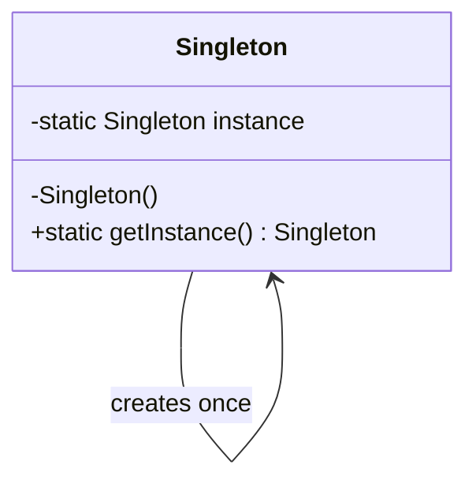

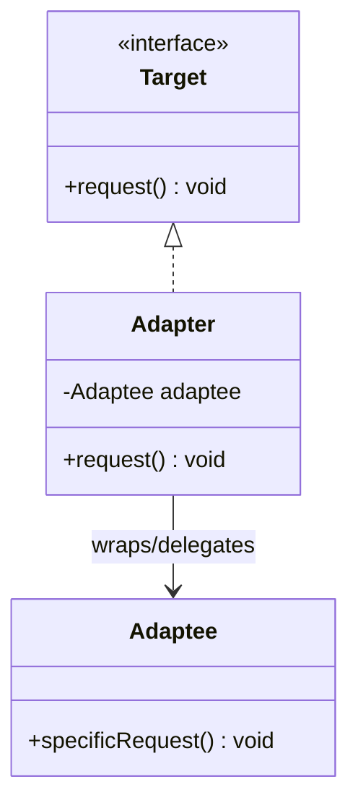

| Creational | Purpose |
|---|---|
| Singleton | One instance, global access point |
| Factory Method | Delegate object creation to subclasses |
| Abstract Factory | Create families of related objects |
| Builder | Construct complex objects step-by-step |
| Prototype | Clone existing objects |

| Structural | Purpose |
|---|---|
| Adapter | Convert one interface into another expected by the client |
| Bridge | Decouple abstraction from implementation |
| Composite | Treat individual objects and compositions uniformly |
| Decorator | Add responsibilities dynamically without subclassing |
| Facade | Simplified interface to a complex subsystem |
| Flyweight | Share fine-grained objects to save memory |
| Proxy | Placeholder controlling access to another object |

</details>

---

### 📌 Notes
- All diagrams use [Mermaid](https://mermaid.js.org/) syntax — they render natively in GitHub, GitLab, and most modern Markdown viewers.
- Marks/time are suggestions for a 12–15 minute handwritten sub-question; adjust per your institution's exam duration.


## Liang Lecture Helps Website:
https://rahmanziaur.github.io/Java/LiangLectures/liangweb.html

# OOP CheatSheet
https://introcs.cs.princeton.edu/java/11cheatsheet/

# OOP
https://medium.com/@harendrakumarrajpoot5/java-oop-cheat-sheet-a-quick-guide-to-object-oriented-programming-in-java-c1a2cc864bfb

# More CheatSheet
https://cheatography.com/tag/oop/

# Complete Course
https://github.com/vineethm1627/OOP
